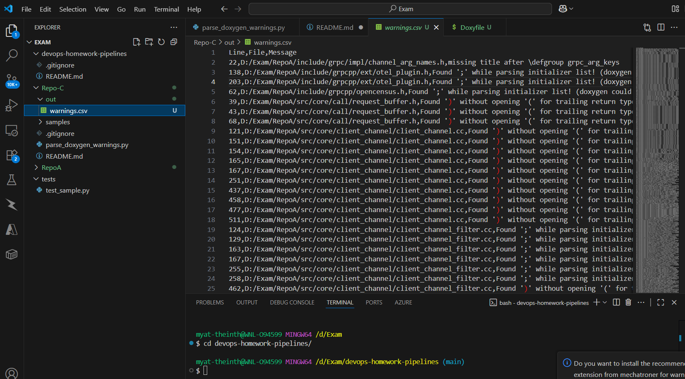

# Task D

# How did you test your pipelines?

I simulated them locally in two ways to mirror what Pipeline B and Pipeline C would do.

** Step‑by‑step manual run**
1. In **Repo A**, created a minimal `Doxyfile` with:
   - `INPUT = .`
   - `FILE_PATTERNS = *.c *.cc *.cpp *.cxx *.h *.hpp *.hxx`
   - `RECURSIVE = YES`
   - `OUTPUT_DIRECTORY = html` 
   - `HTML_OUTPUT = .`
   - `GENERATE_LATEX = NO`
   - `WARNINGS = YES`
   - `WARN_IF_UNDOCUMENTED = YES`
   - `WARN_LOGFILE = warnings.log`
2. Ran:
   ```bash
   doxygen Doxyfile

** Full Flow**
In RepoA
doxygen Doxyfile && cd ../RepoC && python parse_doxygen_warnings.py --input ../RepoA/warnings.log --output out/warnings.csv


# How did you test repoC python?
### With a small sample file
- Steps:
  - Created `samples/warnings.log` with a few fake Doxygen warning lines.
  - Ran:
    ```
    python parse_doxygen_warnings.py --input samples/warnings.log --output out/warnings.csv
    ```
- Checks:
  - CSV header matches expected columns.
  - Non-standard lines are ignored; valid warnings are parsed correctly.

### With real Doxygen output (integration)
- Steps:
  - Generated a real `warnings.log` from Repo A using Doxygen as above.
  - Ran:
    ```
    python parse_doxygen_warnings.py --input ../RepoA/warnings.log --output out/warnings.csv
    ```
- Checks:
  - CSV records align with entries in `warnings.log` (line numbers, file paths, messages).

# RepoA-doc contains binaries
▪ What is the advantage to use LFS?
  - Git LFS (Large File Storage) replaces large binary files in commits with lightweight pointers while storing the actual content in LFS storage.
  - Faster clones and pulls because Git history stays small.
  - Efficient handling of large/binary artifacts (e.g., `.tar.gz`, `.zip`, images).
  - Prevents repo bloat when binaries change frequently.
  - Works natively with GitHub and most Git hosting providers.
▪ <https://git-lfs.github.com/>

# How to adjust this repository to support LFS?
### Git way 
1. Install Git LFS:
2. Track the file types you want in LFS (examples for docs/artifacts):
This updates/creates `.gitattributes`.
3. Commit and push the LFS tracking rules:
4. Commit future large files as usual; they’ll be stored via LFS automatically.

▪ provide links
- Git LFS homepage: https://git-lfs.github.com/
- GitHub Docs — About Git LFS:
https://docs.github.com/en/repositories/working-with-files/managing-large-files/about-git-large-file-storage
- GitHub Docs — Installing Git LFS:
https://docs.github.com/en/repositories/working-with-files/managing-large-files/installing-git-large-file-storage

▪ You might find the git way
▪ Are there other (easier) alternatives
- Store binaries outside Git:
- **Jenkins artifacts:** Keep build outputs in Jenkins; download when needed.
- **Cloud object storage:** AWS S3, Azure Blob, or Google Cloud Storage.
- **GitHub Releases:** Attach versioned artifacts to releases instead of committing them.
- **Artifact repositories:** Sonatype Nexus, JFrog Artifactory, Azure Artifacts.
- Store only checksums/URLs in Git:
- Commit a manifest (e.g., SHA256 and download URL) and fetch binaries during CI.

**Screenshot – CSV output from parser**
